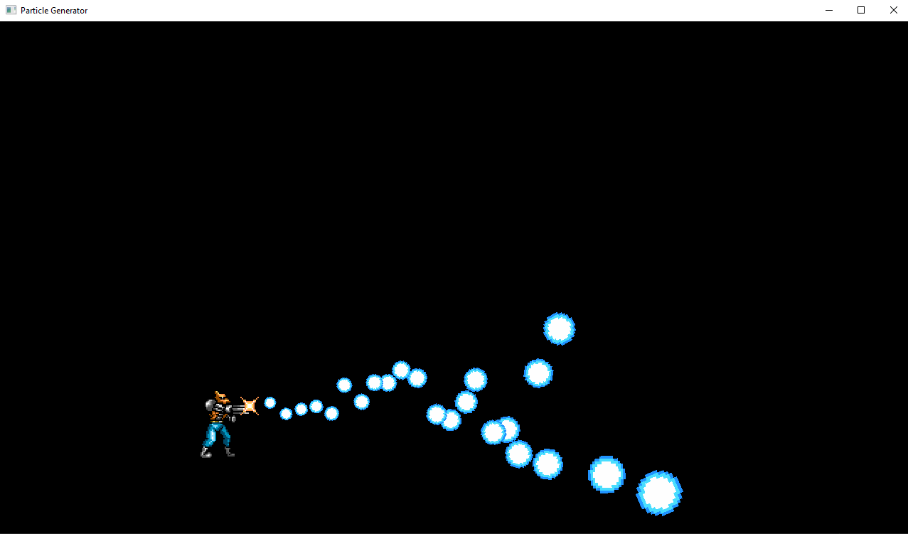
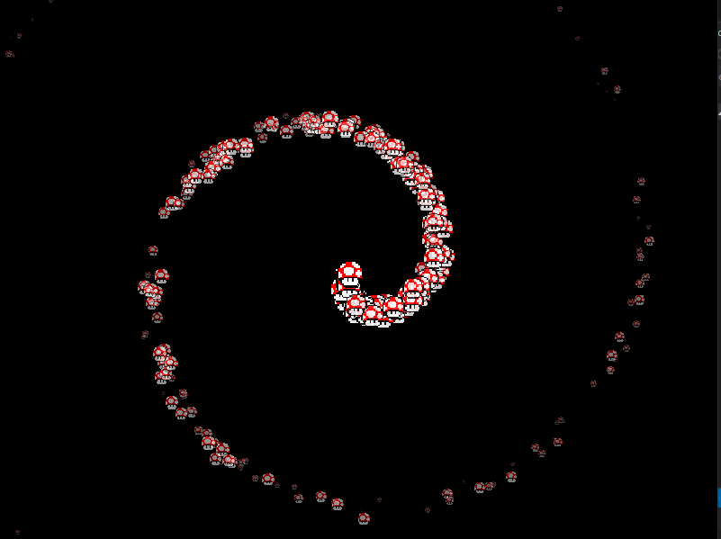

# ParticleGenerator

It is a powerful, yet simple particle generator, that supports many modes - what do you want?
Space dust? Golden spiral? To shoot powerful fireballs like furious Fang? This is it, one-header file, 
that includes multifunctional particle system with flexible interface.

The project requires installed SFML 3.0, see https://github.com/SFML/SFML

